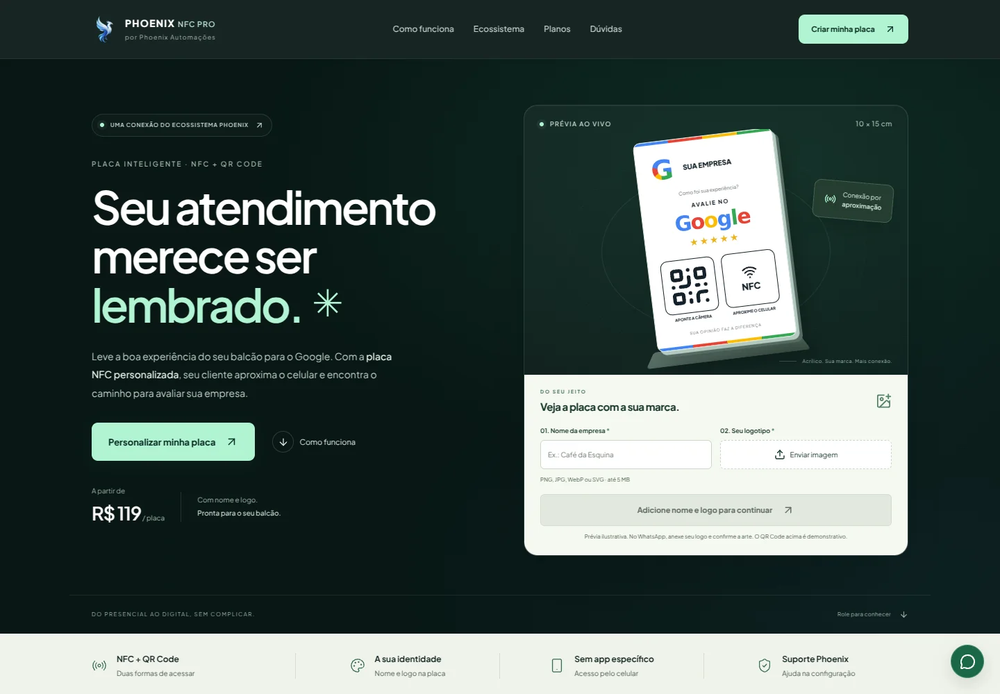

# Phoenix NFC Pro — landing de produto

A página pública apresenta a plaquinha como parte do ecossistema Phoenix Automações, com configuração visual do nome e do logotipo, exemplos por segmento e os três pacotes comerciais existentes.



## Direção visual

Composição original inspirada nos modelos [AI Automation Hero](https://github.com/xiiiabu/motionsites.ai/blob/main/prompts/AI_Automation_Hero.md), [Liquid Glass Agency](https://github.com/xiiiabu/motionsites.ai/blob/main/prompts/Liquid_Glass_Agency.md) e [Nexora Automation](https://github.com/xiiiabu/motionsites.ai/blob/main/prompts/Nexora_Automation.md): abertura escura, hierarquia tipográfica, superfícies translúcidas e produto construído em HTML/CSS. Não usamos vídeos de fundo, bibliotecas de animação adicionais, estatísticas fictícias ou depoimentos inventados.

A paleta acompanha os azuis do logotipo Phoenix: azul-claro nos destaques, azul-marinho nas áreas escuras e superfícies em azul suave. As cores oficiais da marca Google e das estrelas são preservadas. A prévia principal da placa permanece reta.

O cabeçalho e o rodapé usam o logotipo Phoenix fornecido, com transparência preservada, margens vazias removidas e formato WebP otimizado. A fonte Plus Jakarta Sans é servida localmente, com licença em `public/fonts/OFL.txt`. As animações de entrada usam CSS e IntersectionObserver e respeitam a preferência de movimento reduzido. O conteúdo permanece visível se o observador não estiver disponível.

## Configurador e conversão

- Nome da empresa e logotipo atualizam a placa ilustrativa em tempo real.
- PNG, JPEG, WebP e SVG, com limite de 5 MB e validação de decodificação.
- Remover e selecionar novamente o mesmo arquivo funciona.
- A continuação exige nome e logo e abre o WhatsApp com o nome preenchido.
- O arquivo do logo permanece no navegador; o cliente deve anexá-lo na conversa. A interface explica isso antes de continuar.
- O QR Code do simulador é uma ilustração, não um código de produção.
- Os pacotes permanecem em R$ 119, R$ 497 e R$ 697. Os links de pedido já identificam o pacote e o preço.
- Nenhuma mensagem é enviada automaticamente.

Os preços e as perguntas frequentes ficam em `src/components/landing/content.ts`. A placa visual e o configurador foram separados em componentes próprios. O restante do painel mantém suas funções e passa a carregar sob demanda.

## SEO e desempenho

`npm run build` cria o pacote Vite, renderiza a landing em HTML e gera `sitemap.xml`, `robots.txt` e dados estruturados de Organization, WebSite e Product. O preço de Product vem da mesma fonte usada pelos cards. O React hidrata o HTML da landing; rotas internas usam a renderização normal do aplicativo.

O endereço de produção é `https://plaquinhas.phoenixautomacoes.com.br/`, conforme o link público no ecossistema Phoenix. Se o domínio mudar, atualize `SITE_URL` em `content.ts` e os metadados de URL em `index.html` antes do build.

Há título, descrição, canonical, Open Graph e Twitter Card. A imagem de compartilhamento é `public/og-placa.png`; o SVG original está ao lado. Não há avaliações ou notas inventadas no schema. A redação não promete classificação no Google, avaliações automáticas ou compatibilidade NFC universal.

O bundle JavaScript inicial passou de aproximadamente 539 KB para 278 KB antes de compressão, mantendo as telas administrativas em chunks separados. O visitante da landing não precisa baixar o editor de placas, QR Code, calculadora, administração ou confetes.

## Build e publicação

Use uma versão de Node compatível com o Vite instalado (Node 22.12+ ou 24):

```bash
npm ci
npm run lint
npm run build
```

- **Hostinger/Apache:** publique o conteúdo de `dist/`, incluindo `.htaccess`, na pasta do subdomínio. O arquivo configura fallback das rotas, compressão quando disponível e cache dos assets.
- **Node:** `npm start` compila e inicia o servidor existente, com os tipos MIME de fonte, WebP e sitemap corrigidos.
- **Vercel:** a configuração existente utiliza `npm run build` e `dist`.

Não publique `.prerender`, `node_modules` ou arquivos `.env`. O build elimina a saída intermediária de pré-renderização automaticamente. Enviar código ao GitHub não comprova que a hospedagem já publicou essa versão.

## Validação

A revisão funcional cobre nome, prévia de logo, remoção e reenvio, formatos inválidos, arquivos corrompidos e acima do limite, links de WhatsApp, preços dos pacotes, seletor de segmentos, FAQ, menu mobile, acesso ao modal administrativo, privacidade e conteúdo com JavaScript desabilitado. Não é necessário enviar mensagens ou alterar dados reais para verificar esses fluxos.

Foram verificadas larguras de 320, 390, 768, 1024 e 1440 pixels, além do build TypeScript e da auditoria automatizada de acessibilidade. Medições locais de bundle não são uma nota de PageSpeed nem uma garantia de posição nos buscadores.
